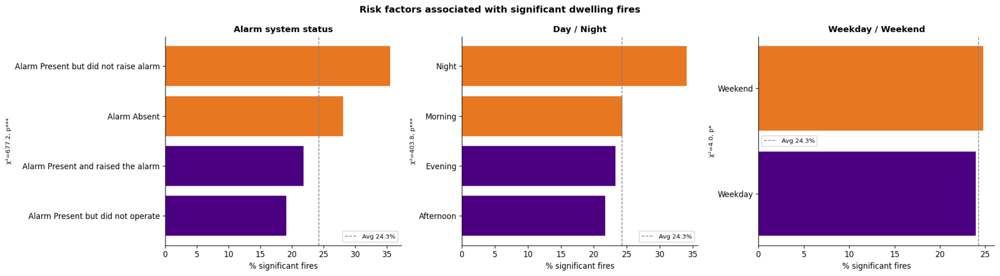
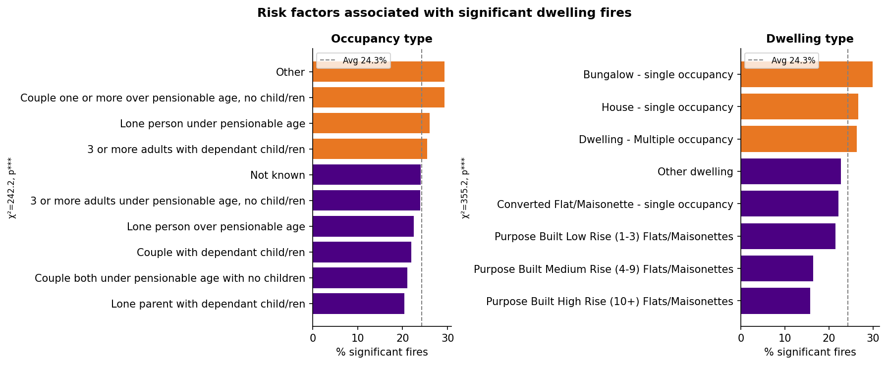
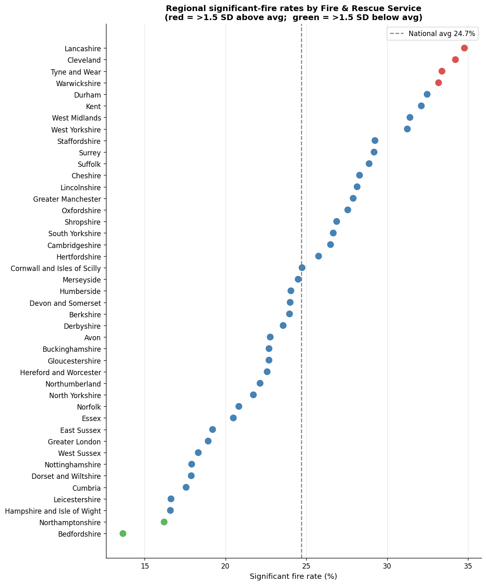
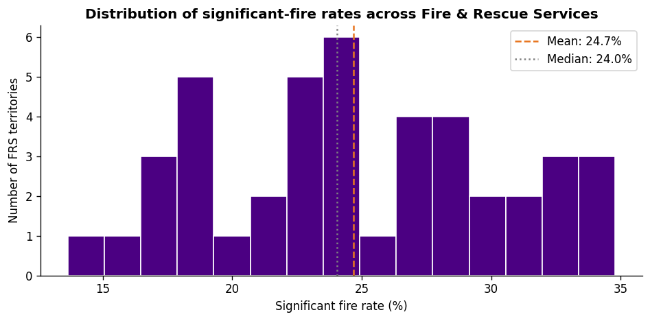
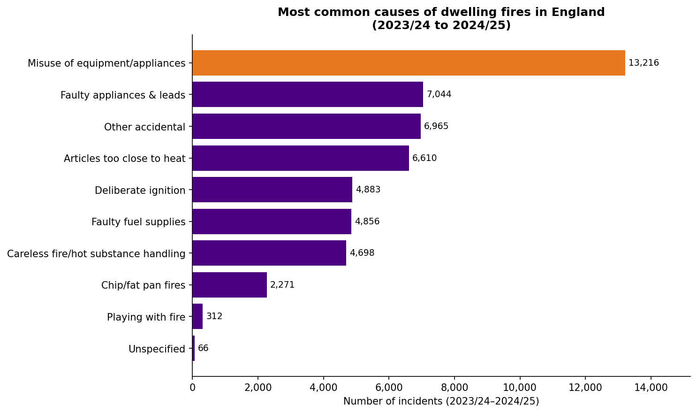
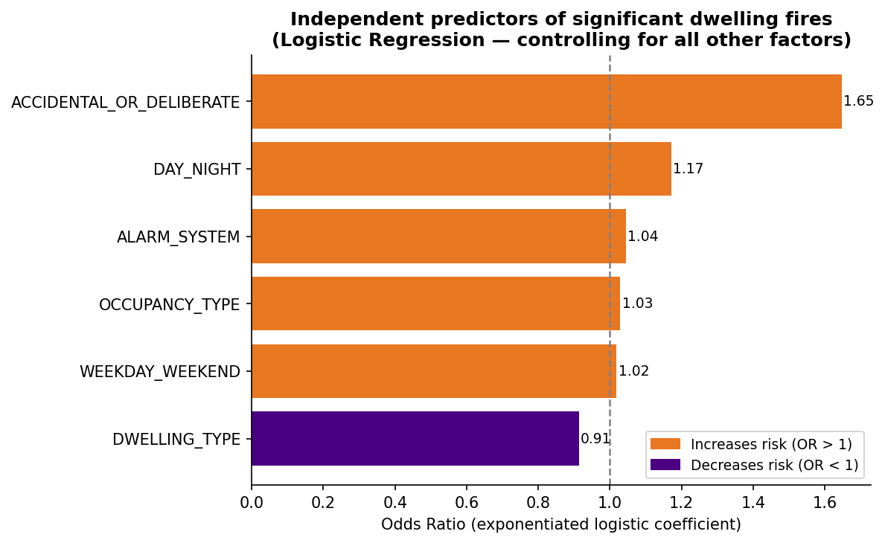
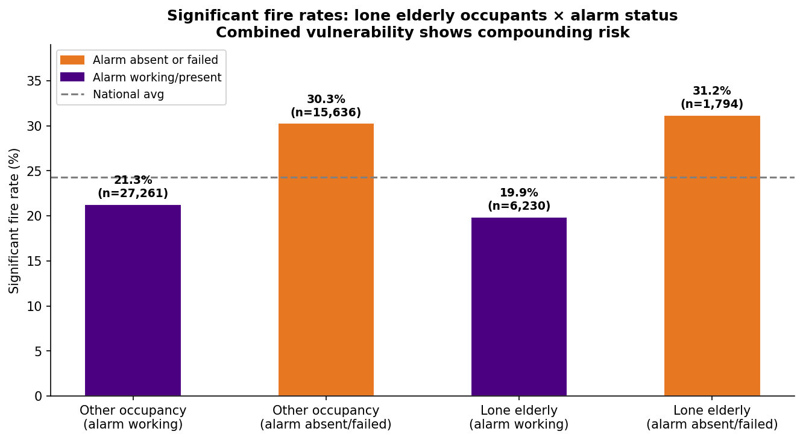

# Fire & Rescue Incident Analysis

Statistical analysis of 50,921 dwelling fires across England, identifying the factors that determine whether a fire becomes serious and quantifying the variation between fire services.



## Purpose
Not every fire is equally serious. Most are contained to the item or room where they started; roughly a quarter cause a casualty or spread further. Understanding what separates the two is what makes prevention spending targetable.

This analysis takes two years of English dwelling fire records and asks three questions: which factors are associated with a fire becoming serious, which of those hold up once confounders are controlled for, and how much do outcomes vary between fire and rescue services.

The analysis was carried out as an analytical assessment in a public audit context, so the emphasis throughout is on what the evidence supports and where it does not — including a headline finding that runs against intuition, and a null result that matters more than several of the positive ones.

## The Data

| | |
| --- | --- |
| Incidents | 50,921 after removing one exact duplicate |
| Period | Financial years 2023/24 (25,588) and 2024/25 (25,334) |
| Coverage | 43 Fire & Rescue Service territories across England |
| Fields | 44 columns covering alarm status, occupancy, dwelling type, timing, cause, response and outcome |

Two columns were excluded as unusable: `BUILDING_SPECIAL_CONSTRUCTION_DESCRIPTION` (95.0% missing) and `RAPID_FIRE_GROWTH` (93.7% missing). `FATALITY_CASUALTY` is 85.7% missing, but that is structural rather than a data problem — the field is only populated when a casualty occurred, so a null means none.

## Defining the Outcome

The dataset has no single severity measure, so one was constructed. A fire is classified as **significant** if it caused a recorded fatality or casualty, or spread beyond the room of origin:

```python
room_confined = ['No fire damage', 'Limited to item 1st ignited',
                 'Limited to room of origin']

df['significant'] = (
    (df['FATALITY_CASUALTY'] == 'Fatality/Casualty') |
    (~df['SPREAD_OF_FIRE'].isin(room_confined))
).astype(int)
```

This captures 12,353 incidents, 24.3% of the total, and gives a binary target that supports both hypothesis testing and regression.

The definition deliberately combines human harm with property spread, on the basis that both represent a failure of containment. It is a judgement call rather than a standard, and it is stated explicitly because every downstream figure depends on it.

## Method

**Association testing.** Six candidate risk factors were tested against the outcome with chi-squared tests of independence, with cells under 30 observations dropped to avoid unstable rates.

**Regression.** Logistic regression estimates which factors predict a significant fire independently — separating, for instance, whether night fires are genuinely more dangerous or simply coincide with particular occupancy types.

**Regional comparison.** Significant-fire rates per FRS territory, with z-scores flagging services more than 1.5 standard deviations from the national mean.

## Findings

### Alarm failure is worse than no alarm

The strongest and least expected result.

| Alarm status | Significant fire rate |
| --- | --- |
| Alarm present but did not raise alarm | **35.5%** |
| Alarm absent | 28.1% |
| Alarm present and raised the alarm | 21.8% |
| Alarm present but did not operate | 19.1% |

A dwelling where an alarm exists but fails to raise the alarm has a *higher* rate of significant fire than one with no alarm at all — 35.5% against 28.1%. A plausible mechanism is false reassurance: occupants who believe they are protected may respond more slowly than those who know they are not. The finding is actionable regardless of mechanism, because it makes alarm *maintenance* a distinct policy target from alarm *installation*.

### Fires at night are far more dangerous

34.1% significant at night against 21.7% in the afternoon. Occupants asleep means later discovery and slower evacuation. This survives regression at OR 1.17, so it is not simply a proxy for who is at home.

### Building type matters more than occupant type

Bungalows show the highest rate at 29.9% and purpose-built high-rise flats the lowest at 15.7% — a difference of nearly half. Single-storey layouts allow fire to spread across the whole footprint, while tall buildings are subject to stricter mandatory fire safety regulation.

Occupancy effects are real but much narrower, ranging from 29.3% (couples with one or more over pensionable age) to 20.3% (lone parents with dependent children).

Weekday versus weekend is statistically significant at p<0.05 but the effect is 24.8% against 24.0% — a good illustration of statistical significance without practical significance, and reported as such.



### Regional variation is large



Lancashire records 34.8% and Bedfordshire 13.7% — a 21 percentage point gap, with a standard deviation of 5.56pp across the 43 services.

These are raw rates with no adjustment for housing stock, deprivation, or population profile. The gap may reflect the risk profile of the areas served rather than service performance, and the analysis says so rather than implying a performance ranking.



### Behavioural causes dominate



Grouping the ten leading causes by the intervention they imply:

| Group | Incidents | Policy response |
| --- | --- | --- |
| Behavioural | ~26,800 | Prevention campaigns and education |
| Equipment failure | ~11,900 | Product safety regulation and recalls |
| Deliberate | 4,883 | Arson — a separate response entirely |

Misuse of equipment or appliances alone accounts for 26.0% of all incidents.

### Independent predictors



| Factor | Odds ratio |
| --- | --- |
| Accidental or deliberate | 1.65 |
| Day / night | 1.17 |
| Alarm system | 1.04 |
| Occupancy type | 1.03 |
| Weekday / weekend | 1.02 |
| Dwelling type | 0.91 |

Deliberate ignition is the strongest independent predictor: arson fires are 65% more likely to become significant after controlling for everything else.

**The model's AUC is 0.582**, which is only modestly better than chance. This is reported prominently rather than buried, because it is itself a finding: the recorded categorical fields explain relatively little of the variation in fire severity. Whatever determines whether a fire becomes serious is largely not captured in this dataset.

### Response time shows no association

```
Point-biserial r = 0.001, p = 0.8821
```

Response time has effectively zero correlation with whether a fire becomes significant. For a fire service this is counterintuitive and worth stating plainly: within the range of response times in this data, arrival speed does not predict outcome.

The most likely explanation is that severity is largely determined before crews arrive — by how quickly the fire was discovered and how far it had spread. That shifts attention from response performance toward detection, and it is the main argument for analysing `IGNITION_TO_DISCOVERY` as a follow-up.

### Alarm status is the lever, not age



| Group | Alarm working | Alarm absent or failed |
| --- | --- | --- |
| Other occupancy | 21.3% (n=27,261) | 30.3% (n=15,636) |
| Lone elderly | 19.9% (n=6,230) | 31.2% (n=1,794) |

Lone elderly occupants with a working alarm sit at 19.9%, *below* the 24.3% national average. The penalty for alarm failure is roughly +9 to +11 percentage points, and it is close to identical for both groups.

That symmetry is the point. Elderly households are not intrinsically higher risk in this data; households with failed alarms are. It reframes the intervention from age-targeted to alarm-targeted, which is both cheaper to deliver and easier to verify.

## Limitations

- **Label encoding in the regression.** Categorical features were integer-encoded, which imposes an ordinal relationship that does not exist. The odds ratios are therefore feature-level and directional rather than per-category. One-hot encoding would give proper per-category estimates and is the first thing to change.
- **Unadjusted regional rates.** No control for housing stock, deprivation or population profile, so regional gaps cannot be attributed to service performance.
- **No confidence intervals.** Smaller territories such as Cumbria (n=410) carry more uncertainty than the point estimates suggest.
- **Two-year snapshot.** Insufficient to separate trend from noise; the year-on-year difference (24.34% to 24.18%) is well within what random variation would produce.
- **Narrow definition of "lone elderly."** Only lone persons over pensionable age, excluding couples over pensionable age, who show a higher rate at 29.3%. A fuller grouping would likely strengthen the finding.
- **The outcome definition is a judgement.** Combining casualty with spread is defensible but not standard; a different definition would move every rate reported here.

## Further Work

- **One-hot logistic regression** for per-category odds ratios by alarm type and dwelling type.
- **Ignition-to-discovery analysis.** Given that response time shows no association, detection time is the more promising variable and is already in the dataset.
- **Deprivation linkage** at LSOA level to test whether regional gaps reflect socioeconomic factors rather than service performance.
- **Bootstrap confidence intervals** for smaller territories.
- **Geospatial mapping** of FRS rates against ONS boundaries to test for regional clustering — the North East concentration is visible in the ranking but unquantified.

## Repository Structure
```
fire-incident-analysis/
├── data/
│   └── fire.xlsx                       # Source dataset (datasheet tab)
├── notebooks/
│   └── fire_analysis.ipynb             # Full analysis
├── docs/
│   └── images/                         # Generated figures
├── Presentation_Fire_Analysis.pptx     # 11-slide summary
├── fire.pdf                            # Notebook export
└── README.md
```

## Running It

```bash
pip install pandas numpy matplotlib seaborn scipy scikit-learn openpyxl
jupyter notebook notebooks/fire_analysis.ipynb
```

The notebook reads `fire.xlsx` and writes five figures to the working directory.

## Presentation

An 11-slide deck summarises the analysis for a non-technical audience: dataset and approach, risk factors across two slides, regional variation, causes, regression, the vulnerable-occupant finding, limitations, and five key findings.

Each slide pairs a chart with the interpretation, and every statistical caveat that appears in this README also appears on the relevant slide rather than being confined to a limitations page.
